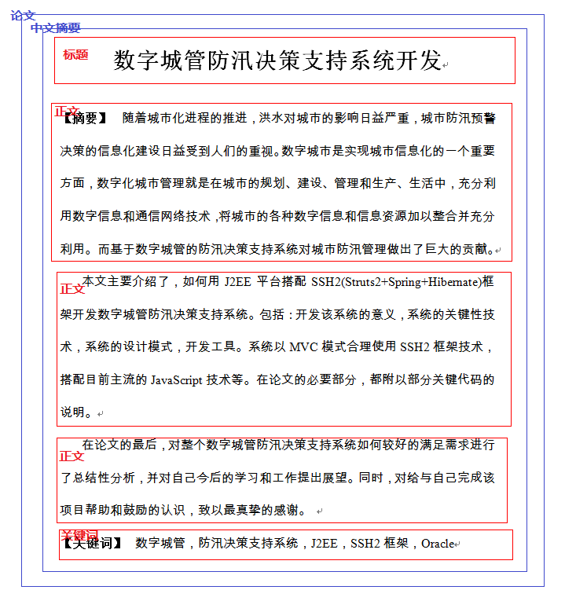

# Word-Checker 小小文档

本文大纲：

* Hello, world!
* Word检测概述

## Hello, world
  
	XmlRuleParser parser = new XmlRuleParser();
	PartDefinition root = parser.parse(Learn.class.getResource("rule.xml"));
	
	MsWordChecker checker = new MsWordChecker();
	checker.check(root, path + "摘要.doc", path + "输出.doc", path + "输出.txt");


整个HelloWorld分成两块，首先从rule.xml中创建PartDefinition树，然后利用该树来校验一个名为“毕业论文”的Word文档，输出到“输出.doc"中，并把中间的扫描日志输出到"输出.txt"中。

## Word检测概述

### 概述，以论文摘要为例

本检测器的检测思路：首先将Word文档按内容分成若干个Part，每个Part表示了文档的某一个部分。然后每个Part都会用指定的Validator去校验。下面以一个论文摘要举例：

rule.xml中的Part的定义：

```xml
<part name="论文">
	<part name="中文摘要">
		<part name="标题" start="nonempty-paragraph" end="end-of-paragraph">
			<validator ref="摘要标题字体" />
		</part>
		<part name="副标题" start="start-with:——" end="end-of-paragraph" greedy="false">
		</part>
		<part name="正文" start="start-with:【摘要】" end="end-of-paragraph">
		</part>
		<part name="正文" start="nonempty-paragraph" end="end-of-paragraph" multi="true" greedy="false">
		</part>
		<part name="关键词" start="start-with:【关键词】" end="end-of-paragraph">
		</part>
	</part>
</part>
```

rule.xml中的"摘要标题字体"Validator的定义：

```xml
	<validator id="摘要标题字体" class="isummer.checker.validator.FontValidator">
		<property name="nameAscii" value="Times New Roman" />
		<property name="nameFarEast" value="宋体" />
		<property name="size" value="二号" />
		<property name="bold" value="true" />
	</validator>
```

该rule.xml对一份文档的切分实例：



首先，XmlRuleParser的parse方法读入rule.xml文件，然后根据其中的Part的定义生成PartDefinition树，返回该树的树根(即”论文“Part)。生成的过程中，系统会根据validator的定义在相应的Part创建Validator实例。Validator创建的相关代码：

```java
	// 创建对象
	Class<?> clazz = Class.forName(clazzName);
	Validator validator = (Validator) clazz.newInstance();
	
	// 设置属性
	for (Element e : xmlElement.getChildren("property")) {
		String name = e.getAttributeValue("name");
		String value = e.getAttributeValue("value");
	
		BeanUtil.setDeclaredPropertyForced(validator, name, value);
	}
```

首先，根据validator标签中的class属性new一个validator类的实例，然后就根据property中定义的属性设置validator对应的javabean的属性。

在有了PartDefinition树之后，将其传递给MsWordChecker的checker方法，该方法根据Part的定义，将Word文档分成若干个Part，然后再利用Validator校验相应的Part，其中检测的代码：

```java
	boolean dfsForValidate(List<ValidatorError> errorList, Document document, Part rootPart) {
		// 前序遍历的校验器
		for (Validator v : rootPart.getDefinition().getPreorderValidators()) {
			// 校验
			v.validate(document, errorList, rootPart);
		}
	
		// 校验子Part
		for (Part p : rootPart.getChildren()) {
			dfsForValidate(errorList, document, p);
		}
	
	    // 后序遍历的校验器
		for (Validator v : rootPart.getDefinition().getPostorderValidators()) {
			// 校验
			v.validate(document, errorList, rootPart);
		}
	}
```

### 总结

总之，整个过程是：MsWordChecker根据写好的rule.xml将Word文件分成若干个Part，然后根据相应的Part所引用的validator，
系统**自动**调用相应validator类的validator方法，在该方法中，检测特定的Part是否合法。

## validator

任何实现了Validator接口的类都可以作为校验器，但必须有一个无参构造器。

	public class FontValidator implements Validator {
		@Override
		public void validate(Document document, List<ValidatorError> errorList, Part part) {
		}
    }

必须有一个无参构造器。


